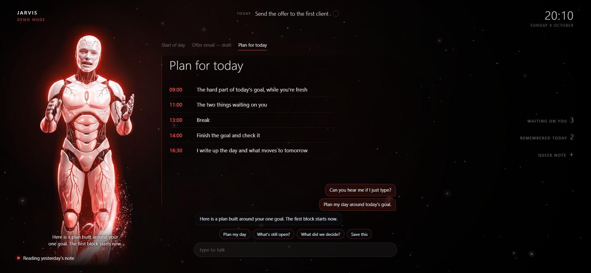

# Jarvis Starter

Your AI forgets everything the moment you close it. This fixes that — and then gives it a face and a voice.

Four commands. The first interviews you and builds your whole memory system from nothing. The second gives it a body and a panel you can work in. The third lets you talk to it out loud. The fourth keeps all three healthy.

**No API key. Nothing metered.** If you already pay for Claude, you already have everything you need.

## What you need

- **Claude Code** — runs on your existing Claude subscription.
- **Python 3.10+** — only for the voice. Skip it if you just want memory and a face.
- **Windows or macOS.** Windows is the long-tested path. macOS support is newer: the memory and the face are the same files, and the voice runs on the processor with the Piper voice.
- **Obsidian** *(optional)* — free, and only a viewer. It makes the folder pleasant to look at and shows how your notes connect. The files are the real thing; Obsidian just reads them.

## Getting started

1. **Download this repository** — either `git clone`, or the green **Code** button → **Download ZIP** → unzip it somewhere.
2. **Open a terminal in that folder** and run `claude`.
3. **Type `/jarvis`.**

That's it. Everything after this happens in conversation.

> **One thing that will save you an hour:** don't run this inside a folder that already belongs to another project. If Claude Code finds a `CLAUDE.md` in any folder above you, it loads *that* identity instead — and the result looks completely normal while being completely wrong. The commands check for this and refuse to start, but it's worth knowing why.

## `/jarvis` — the memory

It asks you nine questions. Answer them honestly, **especially the one about what stalls your work** — that's the answer that makes your rules yours instead of generic. Most people say something tidy and useless there.

Then it makes **its own new folder** and builds everything inside it: your boot file, your index, a folder per area of your life each with its own map note, a daily template, and your list of open work. Its own folder, mixed with nothing.

From then on you run `claude` **inside that folder** and it already knows who you are. That folder is also the one you open in Obsidian.

## `/jarvis-interface` — the panel

Run it in the same folder once your vault exists. It already knows your assistant's name and your language, so it doesn't ask — that's the point, it's a live demonstration that the memory works.

You get a single `interface.html`: a night sky, one accent colour, and **a white android standing on the left** that moves differently when it's waiting, thinking and speaking. That's the recommended look. If you'd rather have your own, pick a ring, an orb or a bar instead — or describe a shape and it gets built.

Around the figure is a screen you can actually work in, which matters if you have one monitor:

- **Today's goal**, one line at the top, with a tick.
- **The stage**: when your assistant makes something — a plan, a draft, a page — it shows it there instead of telling you a file name.
- **What it's doing right now**, so a wait never looks like a hang.
- **The conversation**, typed or spoken, with a few one-click requests.
- **Waiting on you**, **remembered today** and a **quick note**: three words on the right edge that open when you reach for them.

Nothing on it is a second memory. Every line comes from notes already in your vault.

It runs in demo mode on its own and **says so in the corner**: what you see then is an invented example, there to show every part working. It goes live — your goal, your lists, your notes — once the voice is installed.

The customisation surface is two blocks at the top of the file. The shape itself is one function further down — rewrite it, and if your version throws, the built-in one takes over rather than leaving you staring at a black screen.

It also puts **Start and Stop buttons on your desktop**, so you never need a terminal to look at your own assistant. Start opens it fullscreen; Stop closes only that window and leaves your ordinary browser alone.

## `/jarvis-voice` — talking to it

Hold a key, talk, let go. **Nothing is recorded while the key is up** — there is no always-on microphone anywhere in this.

Everything runs on your machine: the hearing (Whisper), the speaking (Piper), and the thinking (the Claude you already pay for). The install looks at your hardware first and picks the best models it can actually run, rather than guessing.

- It answers in about **1.7 seconds**, because it holds one live session open and starts speaking the first sentence while it's still writing the rest.
- **Interrupt it.** Hold the key while it's mid-sentence and it stops instantly and starts listening, because someone who interrupts is about to talk.
- The same Start button now brings up the face **and** the voice, and the face goes live — it moves with your actual voice instead of animating to nothing.

## `/jarvis-check` — keeping it healthy

Run it now and then. It checks all three parts: the notes, the face and the voice.

Your assistant also repairs itself while it runs, within a deliberate limit. Safe, reversible things — restarting something that died, falling back to another voice, re-fetching a file that didn't download properly — it just does. Anything that would mean **changing its own code, it does not touch**: it works out what went wrong, writes it down, and tells you. On a machine where nobody reads code, an assistant that rewrites itself turns a small bug into a dead install with no way back.

`/jarvis-check` reads those notes-to-self, so nothing it reported quietly sits there unread.

Plain files don't crash, they *drift*: an index stops matching its folder, a link points at a note that got renamed, a folder appears with no entry on the map. Nothing looks broken, which is exactly why it's worth checking.

## What you end up with

- **A boot file** — who your assistant is, how it behaves, your rules. Loaded at the start of every session.
- **An index** — the map. Your assistant reads this, sees what exists, and loads only the part it needs. That's the trick that makes large memory affordable: knowing a note exists is as good as holding it, because it's one step away.
- **Folders with index notes** — one per area of your life.
- **A list of open work** — including, separately, the things blocked on *you*. That list is usually the one that changes how much actually gets done.
- **A face and a voice**, both driven by the same vault.

All plain text. All yours. Nothing locked inside anything, and if you uninstalled every tool tomorrow every file would still be sitting there.

## Where this came from

The approach — a boot file, an index, memory loaded on demand — I learned by watching [jaredrhod](https://youtube.com/@jaredrhod), who explains it better than anyone and gives it away for free. **The method is his.** Every file in this repository is written from scratch and contains none of his work.

## Licence

**PolyForm Noncommercial 1.0.0** — free for any noncommercial purpose.

In plain terms:

- **Use it.** For yourself, your studies, your hobby projects, your own work. Free, forever, no strings.
- **Change it.** Rewrite any of it. That's the point — your assistant should end up nothing like mine.
- **Share it.** Pass it on, fork it, post your version. Just keep the licence with it.
- **Don't sell it.** Not as a product, not as a paid course, not repackaged. That's the one line.

This was given away on purpose. The only thing being asked in return is that nobody takes it wholesale and puts a price tag on it.

Full text in [LICENSE](LICENSE).

### One exception: the android

The white android in `.claude/assets/android/` is this project's own character, and he is **not** covered by the licence above. He is included so your own assistant can wear him. You may not use him, his image or his clips to present, promote or sell anything else, or to make something look like it comes from this project. The exact terms are in [`.claude/assets/android/NOTICE.md`](.claude/assets/android/NOTICE.md).

Want a look that's yours? Pick the ring, the orb or the bar instead, or describe your own.
